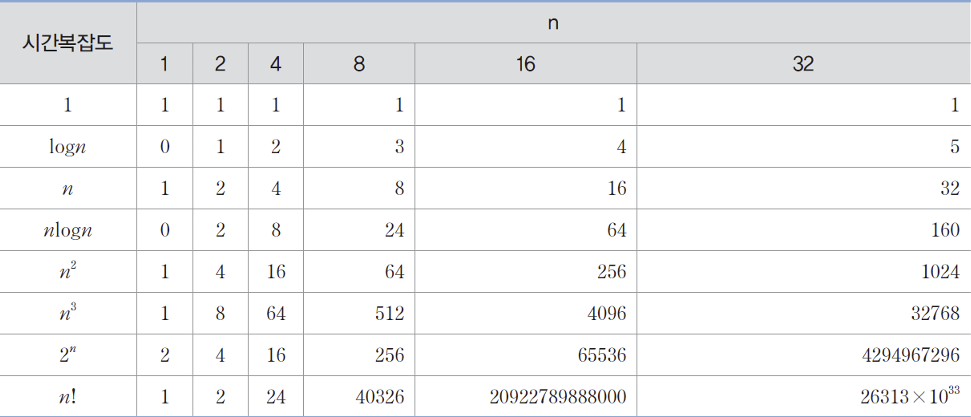
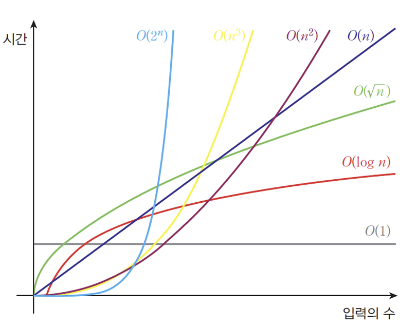

# 자료구조
## 자료구조의 정의
### 데이터를 정리하는 방식, 데이터의 집합
배열, 리스트, 스택, 큐, 트리, 그래프 등이 있다.

## 일상에서의 자료구조
책을 정리하는 **책장**이나 음식을 넣어놓는 **냉장고** 등을 예로 들 수 있다.

# 알고리즘
## 알고리즘의 정의
### 문제를 해결하기 위한 절차
데이터를 정렬하거나 탐색하는 등의 과정이다.

## 일상에서의 알고리즘
음식을 조리하는 순서가 적힌 **레시피**, 최단거리 길을 안내해주는 **내비게이션** 등을 예로 들 수 있다.

# 자료구조와 알고리즘
## 알고리즘의 효율은 자료구조에서 나온다
배열을 처음부터 하나씩 확인해서 가장 작은 수를 찾는 알고리즘이 있다고 가정하자.  
1부터 10이 정렬되어 있는 배열과 무작위로 들어있는 배열이 있다.  
정렬된 배열에서는 한 번만 탐색하면 되지만, 그렇지 않은 배열에서는 탐색을 열 번까지도 해야할 수 있다.  
이처럼 알고리즘에 맞는 적절한 자료구조를 활용해야 알고리즘의 성능과 효율을 올릴 수 있다.

## Flow Chart
### 자연수 $n$( > 0)이 주어졌을 때 소수인지 판단하는 알고리즘

# 추상 데이터 타입(Abstract Data Type)
## 기능의 정의, 구현의 자유
### 입출력과 연산은 알지만 내부 구현은 모른다
수행하고자 하는 기능에 대해서 입출력과 연산에 중점을 두고 내부 구현은 신경쓰지 않는 것이 추상 데이터 타입이다.  
우리가 휴대폰의 여러 기능들을 사용할 때, 그 기능들이 사용되기 위한 **내부 구현을 몰라도 기능을 활용**할 수 있는 것이 예시가 될 수 있다.

# 시간 복잡도(Big-O)
## 알고리즘과 시간
시간 복잡도는 **알고리즘이 실행되는 데 걸리는 시간의 증가율**을 나타내며, 보통 연산의 횟수를 대략적(점근적)으로 표기하는 **빅오 표기법**으로 표현한다.  
양의 정수 $n$을 $n$번 더하는 문제가 있을 때 $n * n$ 또는 $n + n + n + ... + n$ 의 알고리즘을 생각해 볼 수 있다.  
전자의 경우 $n$이 아무리 커져도 **한 번**의 곱셈으로 끝날 수 있지만, 후자의 경우 **$n$번**의 덧셈을 거쳐야한다.  
따라서 이를 빅오 표기법으로 각각 나타내면 $O(1)$, $O(n)$이 된다.  
  
아래는 빅오 표기법의 종류와 각각의 입력의 수에 따른 시간의 그래프이다.  

빅오 표기법에서 알고리즘의 수행 횟수가 $n$에 대한 다항식으로 표현될 때 다항식의 최고차항만 생각하며, $n$의 상수 계수는 생각하지 않는다.  
이는 $n$의 크기가 커질수록 **최고차항의 영향력이 그 아래차항을 무시**할 수 있을 정도로 커지며, **상수 계수 또한 상대적으로 영향이 적어지기** 때문이다.  
따라서 알고리즘이 $2n^2 + 3n + 7$ 수행될 때때 시간 복잡도를 빅오 표기법으로 나타내면 $O(n^2)$이 된다.

## 이진 탐색의 시간 복잡도
이진 탐색(Binary search)은 정렬된 배열에서 탐색 범위를 반으로 줄이며 특정 값을 찾는 알고리즘이다.  
1부터 10까지 정렬된 배열 속에서 이진 탐색으로 $x$를를 찾는다고 하자.  
먼저 $x$와 중앙값인 5를 비교했을 때 $x$가 5라면 탐색이 끝나며, $x$가 중앙값보다 크다면 6~10, 작다면 1~4의 범위에서만 다음 탐색을 하게 된다.  
$x$가 속하지 않은 범위에 대해서는 탐색을 하지 않기 때문에 **탐색 범위는 계속해서 절반**으로 줄어들게 된다.  
이를 $n$에 대한 수식으로 정리하면 $k = log_2n$이므로 이진 탐색의 시간 복잡도는 $O(logn)$이 된다.