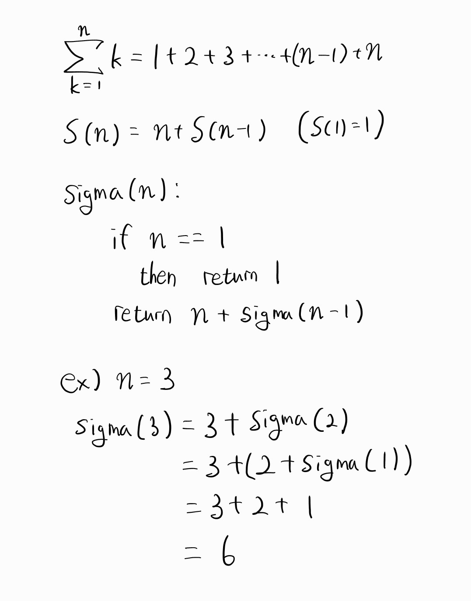
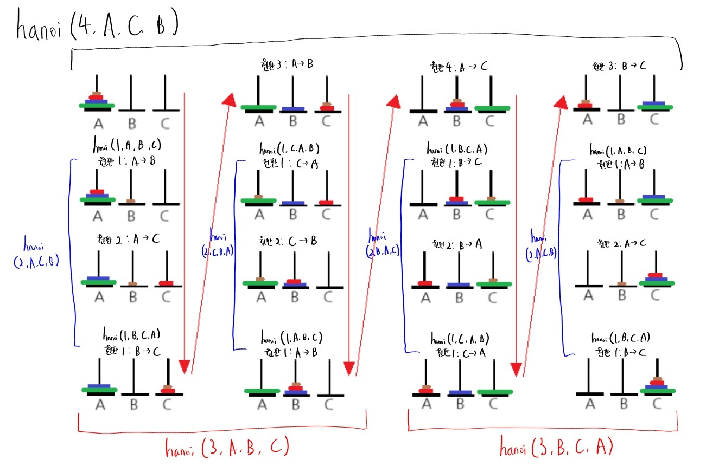

# 순환(Recursion)
## 순환의 정의
### 알고리즘이나 함수가 수행 도중에 자기 자신을 다시 호출하여 문제를 해결하는 기법
함수 내부에서 자기 자신을 호출하며, 무한 루프의 발생을 피하기 위해 탈출 조건이 필요하다.

### $\sum\limits_{k=1}^{n} k$를 순환으로 계산


# 알고리즘의 구현
## 순환과 반복
### 각각 장단점이 존재한다
**순환**으로 알고리즘을 구현하면 코드가 **간결해지고 이해하기 쉽다**. 그러나 반복적인 호출로 인해 **메모리 사용량이 증가**할 수 있고 연산이 각각 이루어지기 때문에 **같은 연산이 여러번 수행**될 수 있는 단점이 있다.  
**반복문**을 통해 알고리즘을 구현하면 **실행 속도가 빠르고 메모리 사용이 적지만**, 특정 문제에서 **코드가 길어지고 복잡해질 수 있다**.

## 순환 구현
### $x^n$을 $O(logn)$ 복잡도를 가지도록 구현
```c
int power(int _x, int _n) {
    if (_n == 0) {
        return 1;
    }
    else if (_n % 2 == 0) {
        return power(_x*_x, _n/2);
    }
    else {
        return _x*power(_x*_x, (_n-1)/2);
    }
}
```  
$O(logn)$의 복잡도를 가지려면 함수가 수행될 때마다 $n$이 절반으로 줄어들게 해야한다.  
함수의 인수로 $\frac{n}{2}$를 주기 위해서 $x^n = (x^2)^\frac{n}{2} = x*(x^2)^\frac{n-1}{2}$으로  식을 변환한 후 각각 $n$이 짝수일 때와 홀수일 때로 조건을 주어 수행되게 할 수 있다.  
여기서 $n$을 더이상 나눌 수 없게 되면 함수의 호출을 중지해야 하므로 $n = 0$의 탈출 조건과 $x^0$의 값인 1을 반환해야한다.  
이 과정을 통해 $x^n$이 $O(logn)$의 복잡도를 가지도록 할 수 있다.

### 피보나치 수열 구현
```c
int fibo(int _n) {
    if (_n == 0) {
        return 0;
    }
    if (_n == 1) {
        return 1;
    }
    return (fibo(_n - 1) + fibo(_n - 2));
}
```
피보나치 수열을 순환으로 구현하게 되면 같은 항을 여러번 계산하게 되며, $n$이 커질수록 비효율성이 심해진다.  
중복 계산 문제를 해결하기 위해 배열에 저장하면서 계산하는 방식을 활용할 수 있다.  
```c
int arr[100] = { 0, };
int fibo_arr(int _n) {
    if (_n == 0) {
        return 0;
    }
    if (_n == 1) {
        return 1;
    }

    if (arr[_n] != 0) { // 배열에 이미 값이 존재할 경우
        return arr[_n];
    }
    
    // 배열에 계산 값 저장
    arr[_n] = fibo_arr(_n - 1) + fibo_arr(_n - 2);

    return (fibo_arr(_n - 1) + fibo_arr(_n - 2));
}
```
위 코드처럼 배열에 계산 값을 저장하고 해당 인덱스에 값의 존재 유무를 먼저 따짐으로써 불필요한 중복 계산을 줄일 수 있게 된다.

### 하노이탑 구현
아래는 하노이탑을 순환으로 구현한 코드와 함수의 호출 반환 과정을 그린 그림이다.
```c
#include <stdio.h>

void hanoi(int _n, char _src, char _dst, char _tmp) {
    if (_n == 1) {
        printf("원판 1을 %c에서 %c로 옮긴다.\n", _src, _dst);
    }
    else {
        // n-1번째 원판을 임시로 옮긴다.
        hanoi(_n - 1, _src, _tmp, _dst);
        // 가장 큰 원판을 옮긴다.
        printf("원판 %d을 %c에서 %c로 옮긴다.\n", _n, _src, _dst);
        // n-1번째 원판을 옮긴다.
        hanoi(_n - 1, _tmp, _dst, _src);
    }
}

int main() {
    int n = 4; // 원판 개수
    hanoi(n, 'A', 'C', 'B');
    return 0;
}
```


### 하노이탑 원판이 100개라면?
하노이탑에서 원판 개수가 $n$일 때 최소 이동 횟수는 $2^n -1$번이다.  
따라서 원판이 100개일 때 최소 이동 횟수는 $ \displaystyle 2^{100} - 1$번이며, 원판이 한 번 이동할 때 걸리는 시간을 1 나노초라고 가정하면 년 단위로 약 40.2조년이 걸리게 된다.