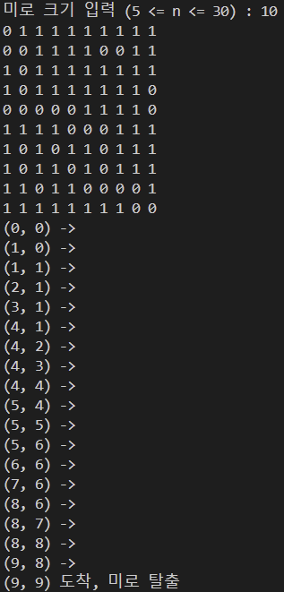

# 구조체와 스택을 활용한 미로 만들기
## 미로를 만드는 조건
1. 미로 크기 `n`을 입력받고 정사각형 `n * n` 미로를 만든다. (5 <= `n` <= 30)  
2. 0은 통로이고 1은 벽이며, 시작점은 (0, 0)이고 도착점은 (`n-1`, `n-1`)이다.  
3. random 함수를 사용해서 벽을 임의의 위치에 만든다.  
4. 미로 경로 탐색 알고리즘을 이용해서 경로가 있는지 확인한다.  
5. 경로가 있다면 3번으로 진행해서 벽을 좀 더 만든다.  
6. 경로가 없다면 3번에서 만든 벽을 지우고 다시 3번을 시행한다.  
7. 위 과정을 벽 블록이 전체 블록 개수의 70% 이상이 될 때까지 반복한다.  
8. 미로가 완성되면 출력한다.  

## 미로 만들기 구현
### 미로 구성
```c
#define SZ 30
int n = 0;

int Maze[SZ][SZ] = { 0, };
int tmpMaze[SZ][SZ] = { 0, };

typedef struct
{
    int row;
    int col;
} COORD;
```
미로를 구성하는 요소들이다.  
미로의 최대크기를 30으로 정하고 미로 크기 `n`을 입력받아 그만큼만 활용한다.  
미로는 본 미로와 임시 미로로 나뉘며, 임시 미로에서 먼저 벽 생성 및 경로 탐색을 거친 뒤 본 미로에 변경 사항을 복사하게 된다.  
구조체 `COORD`는 미로 경로 탐색 및 벽 생성에 사용할 (`row`, `col`)의 좌표 정보를 담는다.  

### 미로 경로 탐색 알고리즘
#### 스택의 활용
```c
#define STACK_SZ (SZ * SZ)

COORD path_stack[STACK_SZ];
int top = -1;

int isStackEmpty()
{
    return (top == -1);
}

int isStackFull()
{
    return (top == (STACK_SZ - 1));
}

void push(COORD _c)
{
    if (isStackFull())
    {
        return;
    }
    top += 1;
    path_stack[top] = _c;
    return;
}

void pop()
{
    if (isStackEmpty())
    {
        return;
    }
    top -= 1;
    return;
}

COORD peek()
{
    COORD result = {-1, -1};

    if (isStackEmpty())
    {
        return result;
    }

    result = path_stack[top];
    return result;
}
```
경로 탐색 도중 지나온 경로를 저장하기 위한 스택이다.  
스택의 크기는 미로의 총 블록 개수이며, 스택의 최상단값에 접근하기 위한 인덱스 `top`을 선언한다.  
`isStackEmpty()`: 스택이 비어있는지 확인하는 함수이다.  
`top`이 -1이면 접근할 인덱스가 없으므로 스택이 비어있다고 판단하여 non-zero를 반환, 접근할 인덱스가 있다면 스택에 값이 있다고 판단하여 zero를 반환한다.  
`isStackFull()`: 스택이 다 찼는지 확인하는 함수이다.  
`top`이 스택의 마지막 인덱스에 도달했다면 스택이 다 찼다고 판단하여 non-zero를 반환, 그렇지 않으면 zero를 반환한다.  
`push(COORD _c)`: 스택에 값을 저장하는 함수이다.  
스택이 다 차있다면 값을 넣을 수 없으므로 함수를 종료하고, 공간이 있다면 `top`을 먼저 증가시키고 스택의 최상단에 구조체 `_c`의 정보(좌표)를 저장한다.  
`pop()`: 스택에서 값을 빼는 함수이다.  
스택이 비어있다면 뺄 값이 없으므로 함수를 종료하고, 스택 내에 값이 있다면 `top`을 감소시키고 종료한다. 스택의 최상단값을 실제로 빼지 않고 인덱스만 감소시키며, 남아 있는 값에 재접근하게되면 덮어씌울 수 있도록 한다.  
`peek()`: 스택의 최상단값을 확인하는 함수이다.  
최상단값의 정보를 저장할 구조체를 선언하고 스택이 비어있다면 (-1, -1)을 반환하여 스택이 비어있다는 것을 전달한다. 최상단값이 있다면 해당 값을 반환한다.  

#### 방문한 곳을 저장
```c
COORD visited[SZ * SZ];
int vidx = -1;

int checkVisited(COORD _c)
{
    for (int i = 0; i <= vidx; i++)
    {
        if (visited[i].row == _c.row && visited[i].col == _c.col)
        {
            return 1;
        }
    }
    return 0;
}

void addToVisited(COORD _c)
{
    if (checkVisited(_c) == 0)
    {
        vidx += 1;
        visited[vidx] = _c;
    }
}
```
경로 탐색 도중 방문한 곳을 저장하기 위한 과정이다.
배열의 크기는 미로의 총 블록 개수이며, 배열에 저장된 값에 접근하기 위한 인덱스 `vidx`를 선언한다.  
`checkVisited(COORD _c)`: `_c`의 좌표가 이미 방문했던 곳인지 확인하는 함수이다.  
`visited`배열과 `_c`를 비교하여 방문했다면 1, 그렇지 않으면 0을 반환한다.  
`addToVisited(COORD _c)`: `_c`의 좌표를 방문 배열에 추가하는 함수이다.  
`_c`의 좌표가 방문했던 곳인지 확인한 후, 처음 방문하는 곳이라면 `vidx`를 먼저 증가시키고 `visited`배열에 값을 추가한다.

#### 갈 수 있는 방향 탐색
```c
int isInMaze(COORD _c)
{
    return ((_c.row >= 0) && (_c.row < n) && (_c.col >= 0) && (_c.col < n));
}

int isWall(COORD _c)
{
    return (tmpMaze[_c.row][_c.col] == 1);
}

COORD findWhereToGo(COORD _c)
{

    COORD target;

    target.row = _c.row + 1;
    target.col = _c.col;
    if ((isInMaze(target) != 0) && (isWall(target) == 0) && (checkVisited(target) == 0))
    {
        return target;
    }

    target.row = _c.row;
    target.col = _c.col + 1;
    if ((isInMaze(target) != 0) && (isWall(target) == 0) && (checkVisited(target) == 0))
    {
        return target;
    }

    target.row = _c.row - 1;
    target.col = _c.col;
    if ((isInMaze(target) != 0) && (isWall(target) == 0) && (checkVisited(target) == 0))
    {
        return target;
    }

    target.row = _c.row;
    target.col = _c.col - 1;
    if ((isInMaze(target) != 0) && (isWall(target) == 0) && (checkVisited(target) == 0))
    {
        return target;
    }

    target.row = -1;
    target.col = -1;
    return target;
}
```
현재 좌표에서 갈 수 있는 경로를 상하좌우로 탐색하는 과정이다.  
`isInMaze(COORD _c)`: `_c`의 좌표가 미로 내부인지 판단하는 함수이다.  
미로 내부이면 non-zero, 그렇지 않으면 zero를 반환한다.  
`isWall(COORD _c)`: `c`의 좌표가 벽인지 판단하는 함수이다.  
벽이면 non-zero, 그렇지 않으면 zero를 반환한다.  
`findWhereToGo(COORD _c)`: `_c`의 좌표에서 갈 수 있는 방향을 탐색하는 함수이다.  
상하좌우 방향을 지정해서 확인할 구조체 `target`을 활용하며 미로 내부인지(`isInMaze()`), 벽인지(`isWall()`), 방문했던 곳인지(`checkVisited()`)를 판단하여 미로 내부이고 벽이 아니면서 방문했던 곳이 아니라면 해당 `target`좌표를 반환하고 갈 수 있는 방향이 없다면 (-1, -1)을 반환한다.  

#### 경로 탐색
```c
int checkDestination(COORD _c)
{
    return ((_c.row == (n - 1)) && (_c.col == (n - 1)));
}

int findPath(COORD _s)
{
    COORD current = _s;

    addToVisited(current);

    while (1)
    {
        COORD whereToGo = findWhereToGo(current);

        if (whereToGo.row != -1 && whereToGo.col != -1)
        {
            push(current);
            current = whereToGo;

            addToVisited(current);

            if (checkDestination(current))
            {
                return 1;
            }
        }

        else
        {
            while (1)
            {

                COORD top_coord = peek();

                if ((top_coord.row == -1) && (top_coord.col == -1))
                {
                    return 0;
                }

                whereToGo = findWhereToGo(top_coord);

                if ((whereToGo.row == -1) && (whereToGo.col == -1))
                {
                    pop();
                }

                else
                {
                    current = whereToGo;
                    addToVisited(current);
                    break;
                }
            }
        }
    }
}
```
미로의 도착지까지 경로를 탐색하는 과정이다.  
`checkDestination(COORD _c)`: `_c`의 좌표가 도착지에 도달했는지 확인하는 함수이다.  
도착지면 non-zero, 그렇지 않으면 zero를 반환한다.  
`findPath(COORD _s)`: 출발지인 `_s`의 좌표를 받아 도착지까지 경로를 탐색하는 함수이다.  
현재 좌표를 나타내는 구조체 `current`, 가야할 좌표를 나타내는 구조체 `whereToGo`, 스택의 최상단값을 나타내는 구조체 `top_coord`를 활용한다.  
`whereToGo`가 유효한 좌표 정보를 가지고 있다면 `current`를 `path_stack`에 저장하고 `whereToGo`의 정보를 받아 `visited`에 저장한다. `current`가 도착지라면 경로 탐색을 종료한다.  
`whereToGo`의 좌표가 유효하지 않다면 `top_coord`의 좌표를 읽는다.  
`top_coord`가 유효한 좌표라면 그 위치에서 갈 수 있는 방향을 탐색하고, 갈 수 있는 방향이 있다면 해당 좌표를 `current`에 저장하고 경로 탐색을 반복하며 갈 수 있는 방향이 없다면 스택의 차상단값을 읽어 경로 탐색을 반복한다.  
`top_coord`의 좌표가 유효하지 않다면 스택이 비어있으며 더 이상 경로가 없다는 뜻이므로 0을 반환하고 경로 탐색을 종료한다.

### 미로 만들기 알고리즘
#### 미로 내부 벽 생성
```c
int isWallEnough()
{
    double wall_count = 0;
    double enough = (double)n * (double)n * 0.7;
    double possible = (double)(n - 1) * (double)(n - 1);
    for (int i = 0; i < n; i++)
    {
        for (int j = 0; j < n; j++)
        {
            if (tmpMaze[i][j] == 1)
            {
                wall_count++;
            }
        }
    }
    if (wall_count > possible)
    {
        return 2;
    }
    if (wall_count >= enough)
    {
        return 1;
    }
    else
    {
        return 0;
    }
}

void makeWall()
{
    srand(time(NULL));

    while (1)
    {
        COORD wall;
        wall.row = rand() % n;
        wall.col = rand() % n;

        if (((wall.row != 0) || (wall.col != 0)) && ((wall.row != (n - 1)) || (wall.col != (n - 1))))
        {
            if (tmpMaze[wall.row][wall.col] == 0)
            {
                tmpMaze[wall.row][wall.col] = 1;
                return;
            }
        }
    }
}
```
미로 내부 랜덤 위치에 벽을 생성하는 과정이다.  
`isWallEnough()`: 임시 미로 내부에 충분한 벽이 있는지 판단하는 함수이다.  
벽의 개수를 세는 `wall_count`, 벽의 비율을 나타내는 `enough`, 미로에 경로가 존재할 수 있는 최대 벽의 개수를 나타내는 `possible`을 활용한다.  
미로 배열 내에 있는 벽의 개수를 세며 벽이 모자라면 0, 충분하면 1을 반환하고 최대 벽 개수를 넘겨 유효한 미로를 만들지 못하면 2를 반환한다.  
`makeWall()`: 임시 미로 내부에 벽을 생성하는 함수이다.  
랜덤 값을 받기위한 시드를 받고 `rand()`값을 미로 크기 `n`으로 나머지 연산하여 벽의 좌표를 지정하는 구조체 `wall`의 `row`와 `col`에 각각 저장한다.  
`wall`의 좌표가 출발지나 도착지가 아닌 경우에 벽을 하나 생성하고 함수를 종료한다. 이때 이미 해당 좌표에 벽이 있는 경우 `wall`의 좌표를 다시 받고 위 과정을 반복한다.  

#### 미로 만들기
```c
void copyMaze(int _e)
{
    if (_e == 0)
    {
        for (int i = 0; i < n; i++)
        {
            for (int j = 0; j < n; j++)
            {
                tmpMaze[i][j] = Maze[i][j];
            }
        }
    }
    else if (_e == 1)
    {
        for (int i = 0; i < n; i++)
        {
            for (int j = 0; j < n; j++)
            {
                Maze[i][j] = tmpMaze[i][j];
            }
        }
    }
}

void makeMaze(COORD _s)
{
    while (1)
    {
        makeWall();

        int exist = findPath(_s);

        if (exist == 1)
        {
            copyMaze(exist);
            if (isWallEnough() == 1)
            {
                return;
            }

            else
            {
                top = -1;
                vidx = -1;
            }
        }

        else
        {
            if (isWallEnough() == 2)
            {
                copyMaze(exist + 1);
                printf("미로의 경로가 없습니다.\n");
                return;
            }
            else
            {
                copyMaze(exist);
                vidx = -1; 
            }
        }
    }
}
```
미로를 만드는 과정이다.  
`copyMaze(int _e)`: 본 미로와 임시 미로 중 하나의 미로를 다른 미로에 복사하는 함수이다.  
어떤 미로를 복사할 것인지 `_e`를 통해 정해준다. `_e`가 0이면 본 미로를 임시 미로에 복사하고, `_e`가 1이면 임시 미로를 본 미로에 복사한다.  
`makeMaze(COORD _s)`: 미로를 만드는 함수이다.  
`makeWall()`을 통해 임시 미로에 벽을 하나 생성한 후 미로의 시작 좌표를 담고 있는 구조체 `_s`를 받고 `findPath()`를 통해 경로를 찾는다.  
경로가 있을 때 벽이 충분히 생성되었다면 임시 미로를 본 미로에 복사하고, 벽이 불충분하다면 `path_stack`과 `visited`배열을 초기화하기 위해 각 인덱스를 -1로 초기화한다.  
경로가 없을 때는 `visited`배열을 초기화하고 임시 미로를 본 미로로 다시 돌려서 위 과정을 반복한다.  
이때 벽을 더 이상 생성할 수 없는 경우에는 경로가 없는 임시 미로를 본 미로에 복사한 후 미로의 경로가 없다고 출력하고 미로 만들기를 종료한다.  

### 미로 출력하기
```c
void showMaze()
{
    for (int i = 0; i < n; i++)
    {
        for (int j = 0; j < n; j++)
        {
            printf("%d ", Maze[i][j]);
        }
        printf("\n");
    }
}

void showPath()
{
    for (int i = 0; i <= top; i++)
    {
        printf("(%d, %d) ->\n", path_stack[i].row, path_stack[i].col);
    }
    printf("(%d, %d) 도착, 미로 탈출\n", n - 1, n - 1);
}
```
완성된 미로와 탈출 경로를 출력하는 과정이다.  
`showMaze()`: 미로를 출력하는 함수이다.  
벽은 1, 통로는 0으로 출력한다.  
`showPath()`: 미로의 탈출 경로를 출력하는 함수이다.  
탈출 경로는 `path_stack`에 저장되어 있으므로 스택의 값을 밑에서부터 출력하여 보여준다.  

### 메인 함수
```c
int main()
{
    printf("미로 크기 입력 (5 <= n <= 30) : ");
    scanf("%d", &n);

    COORD start = {0, 0};

    makeMaze(start);

    showMaze();

    // 미로 출력하기 (문자)
    // showMazePath();

    if (top != -1)
    {
        showPath();
    }

    return 0;
}
```
메인 함수에서는 미로 크기 `n`을 입력받고 시작 좌표인 구조체 `start`를 선언한 후 미로를 만들고 출력한다.  
이때 스택에 값이 있는 경우, 즉 경로가 있는 경우에만 탈출 경로를 출력한다.  

## 미로 만들기 실행 결과



## 코드 전문
```c
#include <stdio.h>
#include <stdlib.h>
#include <time.h>

#define SZ 30              // 미로의 최대 크기
#define STACK_SZ (SZ * SZ) // 스택의 최대 크기

int n = 0; // 정사각형 미로의 한 변의 길이

// 좌표를 나타내는 구조체
typedef struct
{
    int row;
    int col;
} COORD;

// stack에 필요한 것들
// stack 정의
COORD path_stack[STACK_SZ];
int top = -1;

// 스택이 비었는지 확인
int isStackEmpty()
{
    return (top == -1);
}

// 스택이 다 찼는지 확인
int isStackFull()
{
    return (top == (STACK_SZ - 1));
}

// 스택에 값 저장하기
void push(COORD _c)
{
    // 스택이 다 차있을 경우
    if (isStackFull())
    {
        return;
    }

    // 스택에 공간이 있는 경우
    top += 1;
    path_stack[top] = _c;
    return;
}

// 스택에서 값 빼기
void pop()
{
    // 스택이 비어있을 경우
    if (isStackEmpty())
    {
        return;
    }

    // 스택에서 날릴 값이 있는 경우
    top -= 1;
    return;
}

// 스택의 최상단값 보기
COORD peek()
{
    // 값을 반환할 변수 선언
    COORD result = {-1, -1};

    // 스택이 비어있을 경우
    if (isStackEmpty())
    {
        return result;
    }

    // 스택의 최상단에 값이 있는 경우
    result = path_stack[top];
    return result;
}

// 본 미로와 임시 미로 (최대크기로 만들고 입력받은 사이즈만큼 활용)
int Maze[SZ][SZ] = {
    0,
};
int tmpMaze[SZ][SZ] = {
    0,
};

// 방문했던 곳을 저장하는 배열
COORD visited[SZ * SZ];
int vidx = -1; // idx = 0은 맨 처음 방문한 곳

// 좌표 _c를 방문했었는지 판단 (했으면 non-zero, 안했으면 zero)
int checkVisited(COORD _c)
{
    for (int i = 0; i <= vidx; i++)
    {
        if (visited[i].row == _c.row && visited[i].col == _c.col)
        {
            return 1;
        }
    }
    return 0;
}

// 방문한 곳을 배열에 추가
void addToVisited(COORD _c)
{
    // 방문했던 곳인지 검사하고 없으면 추가
    if (checkVisited(_c) == 0)
    {
        vidx += 1; // 배열의 인덱스를 먼저 증가시킴
        visited[vidx] = _c;
    }
}

// 좌표가 미로 내부인지 판단 (내부이면 non-zero, 외부이면 zero)
int isInMaze(COORD _c)
{
    return ((_c.row >= 0) && (_c.row < n) && (_c.col >= 0) && (_c.col < n));
}

// 좌표가 벽인지 판단 (벽이면 non-zero, 아니면 zero)
int isWall(COORD _c)
{
    return (tmpMaze[_c.row][_c.col] == 1);
}

// 갈 수 있는 길 찾기
COORD findWhereToGo(COORD _c)
{

    COORD target; // 체크할 방향을 저장하는 함수

    // 아래
    target.row = _c.row + 1;
    target.col = _c.col;
    // 1. 미로 내부인가?, 2. 벽인가?, 3. 가본 적 있는가?
    if ((isInMaze(target) != 0) && (isWall(target) == 0) && (checkVisited(target) == 0))
    {
        return target;
    }

    // 오른쪽
    target.row = _c.row;
    target.col = _c.col + 1;
    // 1. 미로 내부인가?, 2. 벽인가?, 3. 가본 적 있는가?
    if ((isInMaze(target) != 0) && (isWall(target) == 0) && (checkVisited(target) == 0))
    {
        return target;
    }

    // 위
    target.row = _c.row - 1;
    target.col = _c.col;
    // 1. 미로 내부인가?, 2. 벽인가?, 3. 가본 적 있는가?
    if ((isInMaze(target) != 0) && (isWall(target) == 0) && (checkVisited(target) == 0))
    {
        return target;
    }

    // 왼쪽
    target.row = _c.row;
    target.col = _c.col - 1;
    // 1. 미로 내부인가?, 2. 벽인가?, 3. 가본 적 있는가?
    if ((isInMaze(target) != 0) && (isWall(target) == 0) && (checkVisited(target) == 0))
    {
        return target;
    }

    // 갈 수 있는 곳이 없는 경우
    target.row = -1;
    target.col = -1;
    return target;
}

// 미로를 탈출했는지 확인 (받은 좌표가 도착지인지 확인, 도착지면 non-zero, 아니면 zero)
int checkDestination(COORD _c)
{
    return ((_c.row == (n - 1)) && (_c.col == (n - 1)));
}

// 미로 길 찾기
int findPath(COORD _s)
{
    COORD current = _s; // 현재 위치를 출발지로 설정

    // 출발 좌표를 저장
    addToVisited(current);

    // 다음 곳으로 이동
    while (1)
    {
        // 현재 위치에서 갈 수 있는 곳을 찾음
        COORD whereToGo = findWhereToGo(current);

        // 길이 있는 경우
        if (whereToGo.row != -1 && whereToGo.col != -1)
        {
            // 현재 위치를 스택에 저장
            push(current);

            // 다음 위치를 현재 위치로 설정
            current = whereToGo;

            // 현재 위치를 방문한 곳이라고 배열에 저장
            addToVisited(current);

            // 도착한 경우 길 찾기 종료
            if (checkDestination(current))
            {
                return 1;
            }
        }

        // 길이 없는 경우
        else
        {
            while (1)
            {

                COORD top_coord = peek(); // 스택의 최상단값 확인

                // 최상단값이 (-1, -1)인 경우 스택이 비어 있으며 돌아갈 곳이 없음. 즉, 길이 없는 경우 길 찾기 종료
                if ((top_coord.row == -1) && (top_coord.col == -1))
                {
                    return 0;
                }

                // 최상단값(현재 위치 이전 좌표)에서 길 찾기 수행
                whereToGo = findWhereToGo(top_coord);

                // 최상단값에서 현재 위치 제외하고 갈 수 있는 길이 없는 경우
                if ((whereToGo.row == -1) && (whereToGo.col == -1))
                {
                    // 최상단값을 날림(차상단값의 인덱스로 이동)
                    pop();
                }

                // 최상단값에서 갈 수 있는 길이 있는 경우
                else
                {
                    current = whereToGo; // 갈 수 있는 길을 현재 위치로 설정

                    // 현재 위치를 방문한 곳이라고 배열에 저장
                    addToVisited(current);
                    break;
                }
            }
        }
    }
}

// 미로의 벽이 70% 이상인지 확인 (벽을 더이상 생성할 수 없으면 2, 벽이 충분하면 1, 아니면 0을 반환)
int isWallEnough()
{
    double wall_count = 0;
    double enough = (double)n * (double)n * 0.7;
    double possible = (double)(n - 1) * (double)(n - 1);
    for (int i = 0; i < n; i++)
    {
        for (int j = 0; j < n; j++)
        {
            if (tmpMaze[i][j] == 1)
            {
                wall_count++;
            }
        }
    }
    if (wall_count > possible)
    {
        return 2;
    }
    if (wall_count >= enough)
    {
        return 1;
    }
    else
    {
        return 0;
    }
}

// 미로 벽 만들기
void makeWall()
{
    srand(time(NULL)); // 랜덤 값을 얻기 위함

    while (1)
    {
        // 벽이 생성될 좌표를 랜덤으로 설정
        COORD wall;
        wall.row = rand() % n;
        wall.col = rand() % n;

        // 랜덤 좌표가 출발지나 도착지가 아닌 경우 벽 생성 가능
        if (((wall.row != 0) || (wall.col != 0)) && ((wall.row != (n - 1)) || (wall.col != (n - 1))))
        {
            // 랜덤 좌표에 벽이 없는 경우 벽 생성 후 종료
            if (tmpMaze[wall.row][wall.col] == 0)
            {
                tmpMaze[wall.row][wall.col] = 1;
                return;
            }
        }
    }
}

// 미로 복사하기 (어느 미로를 복사할 것인지 받음)
void copyMaze(int _e)
{
    // 본 미로를 임시 미로에 덮어 씌움
    if (_e == 0)
    {
        for (int i = 0; i < n; i++)
        {
            for (int j = 0; j < n; j++)
            {
                tmpMaze[i][j] = Maze[i][j];
            }
        }
    }
    // 임시 미로를 본 미로에 덮어 씌움
    else if (_e == 1)
    {
        for (int i = 0; i < n; i++)
        {
            for (int j = 0; j < n; j++)
            {
                Maze[i][j] = tmpMaze[i][j];
            }
        }
    }
}

// 미로 만들기
void makeMaze(COORD _s)
{
    // 미로 만들기
    while (1)
    {
        // 임시 미로에 벽 생성
        makeWall();

        // 임시 미로에 길이 있는지 확인 및 결과를 저장할 변수
        int exist = findPath(_s);

        // 길이 있을 경우
        if (exist == 1)
        {
            // 임시 미로를 본 미로에 덮어 씌움
            copyMaze(exist);

            // 미로에 벽이 70% 이상인지 확인
            // 벽이 70% 이상인 경우 미로 만들기 종료
            if (isWallEnough() == 1)
            {
                return;
            }

            // 벽이 70% 미만인 경우 해당 과정 반복
            else
            {
                top = -1; // 쌓았던 스택 초기화

                vidx = -1; // 방문했던 좌표 정보를 초기화
            }
        }

        // 길이 없을 경우
        else
        {
            // 벽을 더 이상 생성할 수 없는 경우 미로 만들기 종료
            if (isWallEnough() == 2)
            {
                // 경로 없는 임시 미로를 본 미로에 덮어 씌움
                copyMaze(exist + 1); // +1 은 임시 미로를 본 미로에 덮어 씌우기 위함
                printf("미로의 경로가 없습니다.\n");
                return;
            }
            else
            {
                // 임시 미로를 본 미로로 초기화
                copyMaze(exist);

                vidx = -1; // 방문했던 좌표 정보를 리셋
            }
        }
    }
}

// 미로 출력하기
void showMaze()
{
    for (int i = 0; i < n; i++)
    {
        for (int j = 0; j < n; j++)
        {
            printf("%d ", Maze[i][j]);
        }
        printf("\n");
    }
}

// 경로 출력하기
void showPath()
{
    for (int i = 0; i <= top; i++)
    {
        printf("(%d, %d) ->\n", path_stack[i].row, path_stack[i].col);
    }
    printf("(%d, %d) 도착, 미로 탈출\n", n - 1, n - 1);
}

/*
// 경로 문자로 출력하기
void showMazePath()
{
    for (int i = 0; i < n; i++)
    {
        for (int j = 0; j < n; j++)
        {
            if (Maze[i][j] == 1)
            {
                printf("# ");
            }
            else
            {
                printf("· ");
            }
        }
        printf("\n");
    }
}
*/

int main()
{
    // 미로의 사이즈 입력
    printf("미로 크기 입력 (5 <= n <= 30) : ");
    scanf("%d", &n);

    COORD start = {0, 0}; // 미로의 출발지

    // 미로 만들기
    makeMaze(start);

    // 미로 출력하기 (0, 1)
    showMaze();

    // 미로 출력하기 (문자)
    // showMazePath();

    // 길이 있는 완성된 미로의 탈출 경로 출력하기
    if (top != -1)
    {
        showPath();
    }

    return 0;
}
```